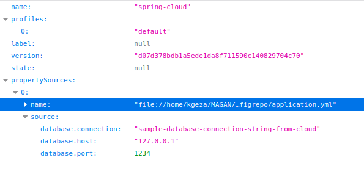

# Spring Cloud Configuration example

Simple example how to use Spring Cloud configuration in your microservice application

## Description

Spring Boot 2.7.6, Spring Cloud 2021.0.5 

## Getting Started

### Dependencies

* Java 11
* Git

### Installing

* Set Java 11
```
sudo update-alternatives --config java (select Java 11)
```
* Create "application.yml" configuration file
```
database:
  connection: sample-database-connection-string-from-cloud
  host: 127.0.0.1
  port: 1234
```

* Create your Git repository and add configuration file
```
md configrepo
cd configrepo
git init
git add application.yml
git commit -m "Add application.yml file"
git push
```
* Edit application.properties file
```
spring.application.name=config-server
server.port=8087

spring.cloud.config.server.git.uri=file://${user.home}/YOUR_PATH/configrepo

spring.cloud.config.server.git.defaultLabel=master
spring.cloud.config.server.git.clone-on-start=true
```

* Build application
```
gradle clean bootjar
```

### Executing program

* Run "spring-cloud-config" application
```
java -jar run spring-cloud-config-1.0.0.jar
```
* Get configuration values by profile (so the default profile is "default")
```
http://localhost:8087/spring-cloud/default
```



## Author
Kenyeres Géza \
https://hu.linkedin.com/in/g%C3%A9za-kenyeres-17341631
